# fabulari-app
# 🌙 Fabulari
### *"Pequeñas historias con gran mensaje."*

> App Android que genera cuentos terapéuticos personalizados con IA para trabajar la inteligencia emocional infantil.

---

## ¿Qué es Fabulari?

Cuando un niño tiene miedo a la oscuridad, está celoso de su hermano o no sabe ponerle nombre a lo que siente, los padres muchas veces no tienen herramientas para acompañarle de forma pedagógica.

**Fabulari** se inspira en la cuentoterapia para generar en menos de un minuto un cuento único adaptado a la situación emocional real del niño — con su protagonista, su escenario y la emoción que necesita trabajar en ese momento. La lectura sigue un método propio de cuatro fases que convierte el momento del cuento en un ritual familiar.

---

## ✨ Funcionalidades principales

- **Generación personalizada** — El padre elige emoción, tono, estilo de ilustración, personajes y describe la situación de su hijo. La IA genera el cuento, las ilustraciones y la narración sin escribir una línea de prompt.
- **Método de las 4 fases** — VER · LEER · PENSAR · SOÑAR
- **Biblioteca comunitaria** — Todos los cuentos generados están disponibles para la comunidad de familias
- **Modo niño** — Experiencia adaptada por edad con PIN parental
- **Gamificación** — XP, niveles y medallas por lectura y creación

---

## 📱 Capturas de pantalla

| Biblioteca | Crear cuento (1/3) | Crear cuento (2/3) |
|:---:|:---:|:---:|
| 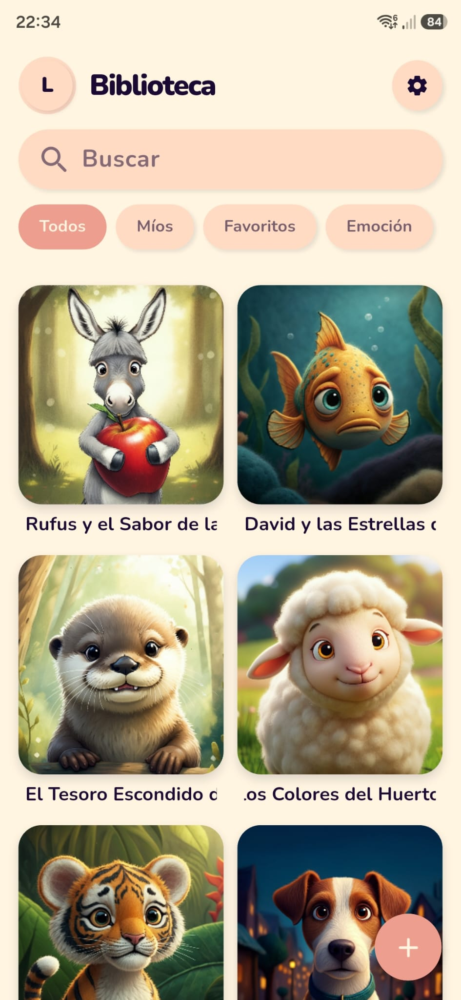 | 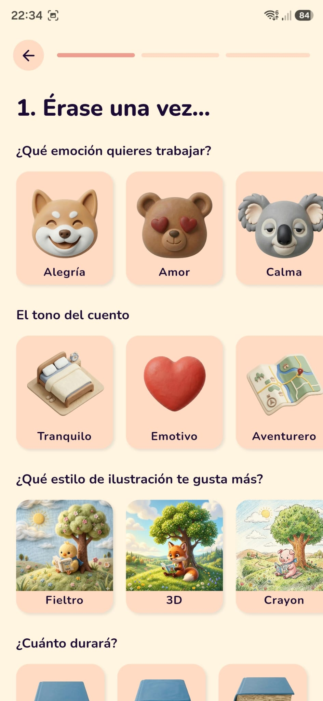 | 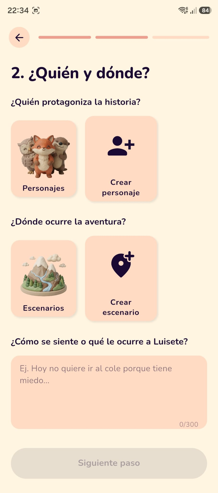 |

| Resumen y audio (3/3) | Fase VER | Fase LEER |
|:---:|:---:|:---:|
| 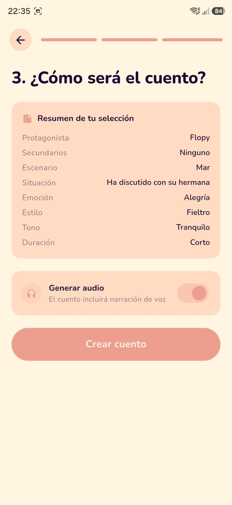 | 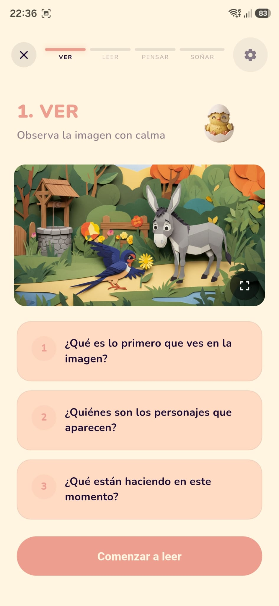 | 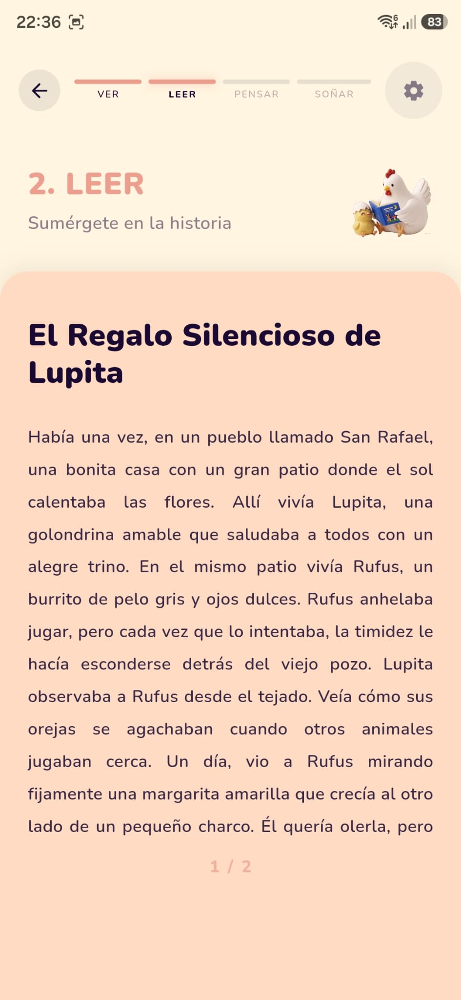 |

| Fase PENSAR | Fase SOÑAR | Mi Perfil |
|:---:|:---:|:---:|
| 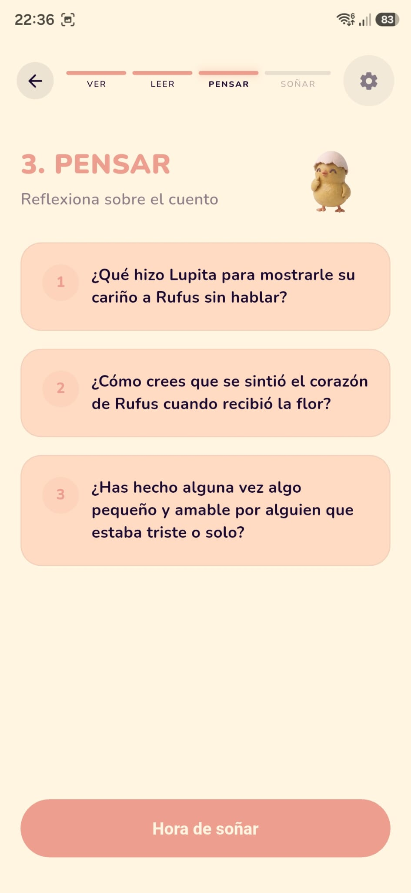 | 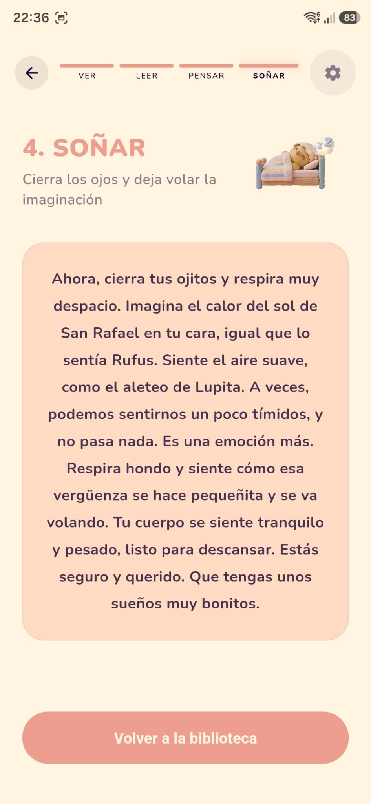 | 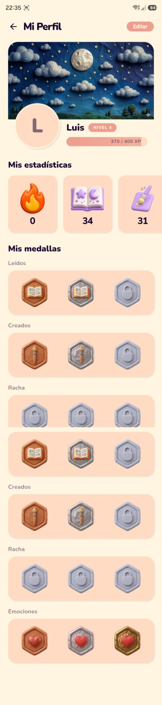 |

| Ficha del cuento | Filtro por emoción |
|:---:|:---:|
| 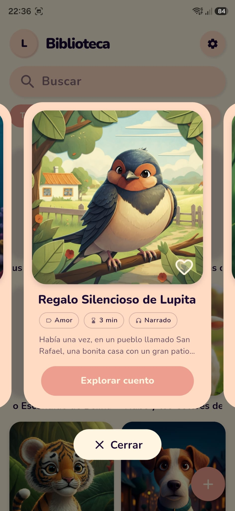 | 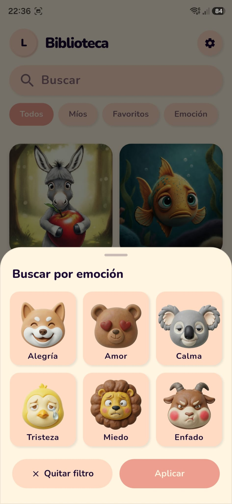 |

---

## 🏗️ Arquitectura del sistema

```
┌─────────────────┐         ┌──────────────────────────────────┐
│                 │         │           SUPABASE               │
│  Flutter/Dart   │ ──────► │  PostgreSQL + RLS                │
│  (Android)      │         │  Auth (Google OAuth)             │
│                 │ ◄────── │  Storage (imágenes + audios)     │
└─────────────────┘         │  Edge Functions (Deno/TS)        │
                            └──────────┬───────────────────────┘
                                       │
                            ┌──────────▼───────────────────────┐
                            │        GOOGLE AI                 │
                            │  Gemini 3.1 Pro → texto          │
                            │  Imagen 3.0 (Vertex AI) → imgs   │
                            │  Cloud TTS → narración           │
                            └──────────────────────────────────┘
```

---

## 🔄 Flujo de generación de un cuento

```
Padre configura el cuento
         ↓
Edge Function generate-story
  ├── Consulta prompts_ia (prompt maestro)
  ├── Consulta guias_terapeuticas (marco psicológico)
  └── Construye prompt final → Gemini
         ↓
Gemini devuelve JSON:
  título · cuento paginado · preguntas PENSAR
  meditación SOÑAR · etiquetas · descriptores imagen
         ↓
Edge Function generate-image × 2
  └── Descriptor narrativo + prompt de estilo (enum) → Imagen 3.0
         ↓
Edge Function text-to-speech (opcional)
  └── Texto → Google Cloud TTS → MP3
         ↓
Upload a Supabase Storage
         ↓
INSERT en tabla cuentos → disponible en biblioteca
```

---

## 🗄️ Modelo de datos

8 tablas en PostgreSQL con RLS activo en todas:

| Bloque | Tablas |
|---|---|
| Identidad y configuración familiar | `familias` · `perfiles` · `personajes` · `escenarios` |
| Contenido | `cuentos` · `historial_lecturas` |
| Configuración IA | `prompts_ia` · `guias_terapeuticas` |

---

## 🔐 Seguridad

- Credenciales en `.env`, nunca hardcodeadas
- **RLS** en todas las tablas — cada familia solo accede a sus propios datos
- Las APIs de Google nunca se exponen al cliente — toda la lógica vive en Edge Functions
- Datos del menor limitados a nombre, edad y género. El nombre se guarda solo en local

---

## 🛠️ Stack tecnológico


| Categoría | Tecnología |
|---|---|
| Frontend | Flutter / Dart |
| Backend | Supabase (PostgreSQL, Auth, Storage, Edge Functions) |
| IA — Texto | Gemini 3.1 Pro Preview |
| IA — Imágenes | Imagen 3.0 via Vertex AI |
| IA — Audio | Google Cloud Text-to-Speech (es-ES-Journey-F) |
| Caché local | SQLite (sqflite) |
| Control de versiones | Git + GitHub |
| Diseño | Figma + Whimsical |

---

## 🚀 Estado del proyecto

| Fase | Estado |
|---|---|
| Definición y planificación | ✅ Completada |
| Diseño UX/UI | ✅ Completada |
| Backend (Supabase + Edge Functions) | ✅ Completada |
| Frontend Flutter | ✅ Completada |
| Pruebas y documentación | ✅ Completada |
| Publicación en Google Play Store | 🔜 Próximamente |

---

## 👨‍💻 Autor

**Jaime Fontán García**
Desarrollo de Aplicaciones Multiplataforma (DAM)
Universidad Francisco de Vitoria · 2026

[](https://linkedin.com/in/tu-perfil)

---

*Este repositorio es una presentación del proyecto. El código fuente es privado.*
