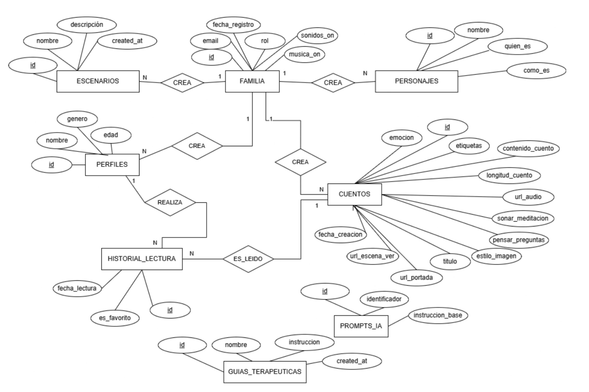

<p align="center">
  
</p>

<h1 align="center">Fabulari</h1>
<p align="center"><i>"Pequeñas historias con gran mensaje."</i></p>

<p align="center">
  
  
  
  
  
</p>

---

Fabulari nació como solución tecnológica para [@cuentosterapia](https://www.instagram.com/cuentosterapia), una cuenta de Instagram especializada en cuentos terapéuticos infantiles que necesitaba una app propia para llevar su contenido a las familias.

Cuando un niño tiene miedo a la oscuridad, está celoso de su hermano o no sabe ponerle nombre a lo que siente, los padres muchas veces no tienen herramientas para acompañarle de forma pedagógica. Fabulari genera en menos de un minuto un cuento único adaptado a esa situación concreta, con el protagonista, el escenario y la emoción que el padre elige. La lectura sigue un método propio de cuatro fases que convierte el momento del cuento en un ritual familiar.

---

## 1. Funcionalidades

- **Generación personalizada.** El padre elige emoción, tono, estilo de ilustración, personajes y describe en texto libre la situación de su hijo. La IA genera el cuento, las ilustraciones y la narración de audio sin escribir una línea de prompt.
- **Método de las 4 fases.** VER, LEER, PENSAR y SOÑAR. Cada fase tiene un propósito pedagógico concreto que convierte la lectura en conversación padre-hijo.
- **Biblioteca comunitaria.** Todos los cuentos generados están disponibles para el resto de familias. Cuanto más crece Fabulari, más rica es la biblioteca para todos.
- **Modo niño.** Experiencia adaptada por edad con PIN parental. Los menores de 7 años solo acceden al reproductor de audio; a partir de 7 pueden elegir entre leer o escuchar.
- **Gamificación.** XP, niveles y medallas por lecturas, rachas y cuentos creados.

---

## 2. Capturas de pantalla

| Biblioteca | Crear cuento (1/3) | Crear cuento (2/3) |
|:---:|:---:|:---:|
|  |  |  |

| Resumen y audio (3/3) | Fase VER | Fase LEER |
|:---:|:---:|:---:|
|  |  |  |

| Fase PENSAR | Fase SOÑAR | Mi Perfil |
|:---:|:---:|:---:|
|  |  |  |

| Ficha del cuento | Filtro por emoción |
|:---:|:---:|
|  |  |

---

## 3. Arquitectura del sistema

El cliente Flutter nunca habla directamente con las APIs de Google. Todas las llamadas pasan por las Edge Functions de Supabase, lo que mantiene las claves de API fuera del dispositivo y permite actualizar la lógica de IA sin publicar una nueva versión de la app.

```
Flutter (Android)
      |
      v
Supabase
  - PostgreSQL + RLS
  - Auth (Google OAuth)
  - Storage (imagenes/ + audios/)
  - Edge Functions (Deno/TypeScript)
      |
      v
Google AI
  - Gemini 3.1 Pro Preview  →  texto del cuento
  - Imagen 3.0 (Vertex AI)  →  ilustraciones
  - Cloud TTS                →  narración de audio
```

---

## 4. Flujo de generación de un cuento

```
El padre configura el cuento en 3 pantallas
      |
      v
Edge Function: generate-story
  - Consulta prompts_ia        (prompt maestro con marcadores)
  - Consulta guias_terapeuticas (marco psicológico de la emoción)
  - Construye el prompt final y llama a Gemini
      |
      v
Gemini devuelve un único JSON con:
  título, cuento paginado, preguntas PENSAR,
  meditación SOÑAR, etiquetas, descriptores de imagen
      |
      v
Edge Function: generate-image x2
  - Descriptor narrativo (Gemini) + prompt de estilo (enum Flutter)
  - Imagen 3.0 genera portada 1:1 y escena VER 16:9
      |
      v
Edge Function: text-to-speech (solo si el padre activó el audio)
  - Google Cloud TTS genera el MP3 con voz es-ES-Journey-F
      |
      v
Upload a Supabase Storage
INSERT en tabla cuentos → disponible en la biblioteca
```

---

## 5. Modelo de datos

8 tablas en PostgreSQL con RLS activo en todas.



| Bloque | Tablas |
|---|---|
| Identidad y configuración familiar | familias, perfiles, personajes, escenarios |
| Contenido | cuentos, historial_lecturas |
| Configuración IA | prompts_ia, guias_terapeuticas |

Las tablas `prompts_ia` y `guias_terapeuticas` no tienen foreign key con el resto del modelo. La conexión no es estructural sino de lógica: la Edge Function las consulta en tiempo de ejecución para construir el prompt antes de llamar a Gemini.

---

## 6. Seguridad

- Credenciales en `.env`, nunca hardcodeadas en el código.
- RLS activo en todas las tablas. Cada familia solo accede a sus propios datos. Los cuentos tienen lectura pública para sostener la biblioteca comunitaria, pero escritura y borrado restringidos a la familia creadora.
- Las APIs de Google nunca quedan expuestas al cliente. Toda la lógica sensible vive en las Edge Functions del servidor.
- Los datos del menor se limitan a nombre, edad y género. El nombre se guarda únicamente en local, nunca sube a la nube.

---

## 7. Stack tecnológico

| Categoría | Tecnología |
|---|---|
| Frontend | Flutter / Dart |
| Backend | Supabase (PostgreSQL, Auth, Storage, Edge Functions) |
| IA — Texto | Gemini 3.1 Pro Preview |
| IA — Imágenes | Imagen 3.0 via Vertex AI |
| IA — Audio | Google Cloud Text-to-Speech (es-ES-Journey-F, Chirp 3 HD) |
| Caché local | SQLite (sqflite) |
| Control de versiones | Git + GitHub |
| Diseño | Figma + Whimsical |

---

## 8. Estado del proyecto

| Fase | Estado |
|---|---|
| 1. Definición y planificación | Completada |
| 2. Diseño UX/UI | Completada |
| 3. Backend (Supabase + Edge Functions) | Completada |
| 4. Frontend Flutter | Completada |
| 5. Pruebas y documentación | Completada |
| 6. Publicación en Google Play Store | Próximamente |

---

## 9. Autor

**Jaime Fontán García**
Desarrollo de Aplicaciones Multiplataforma (DAM)
Universidad Francisco de Vitoria, 2026

[](https://www.linkedin.com/in/jaimefontang/)

---

*Este repositorio es una presentación del proyecto. El código fuente es privado.*
